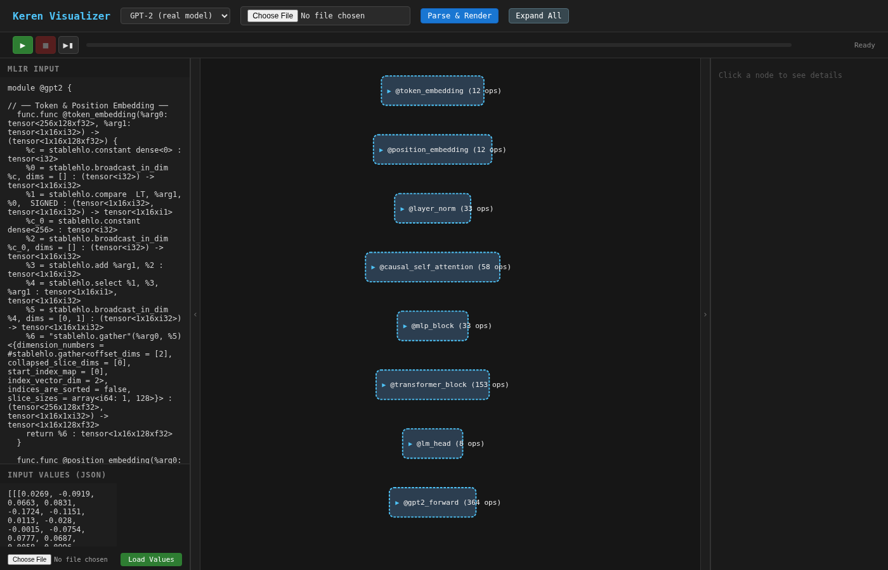

# Keren Visualizer

A browser-based interactive viewer for StableHLO computation graphs with integrated simulation.



## Features

- **MLIR Parsing**: Paste or load StableHLO MLIR and render the dataflow graph
- **Collapsible Function Groups**: Each `func.func` is a collapsible group — start collapsed, double-click to expand
- **Simulation**: Run `keren-sim` from the browser to compute intermediate and final tensor values
- **Transport Controls**: Play, stop, step-through with progress bar
- **Value Annotations**: Simulation results are displayed directly on graph nodes
- **Detail Panel**: Click any node to see op type, SSA name, attributes, tensor type, and simulation values
- **Retractable Panels**: Left (MLIR + inputs) and right (details) panels can be collapsed for a full-width graph view
- **Presets**: Built-in examples including a real JAX-exported GPT-2 model
- **File Input**: Load `.mlir` files and `.json` input values from disk

## Quick Start

### 1. Start the server

```bash
cd keren/visualizer
python3 server.py --port 8080
```

The server auto-detects `keren-sim` at `../build/tools/keren-sim`. To specify a custom path:

```bash
python3 server.py --port 8080 --keren-sim /path/to/keren-sim
```

### 2. Open in browser

Navigate to `http://localhost:8080`.

### 3. Load an example

**Option A — Preset:**
Select a preset from the dropdown (e.g., "GPT-2 (real model)") and click "Parse & Render".

**Option B — File:**
Use the file picker to load a `.mlir` file, then click "Parse & Render".

**Option C — Paste:**
Paste StableHLO MLIR directly into the left panel textarea.

### 4. Run simulation

1. Provide input values in the "Input Values" textarea as a JSON array (one entry per function argument), or load a `.json` file using the file picker
2. Click the green play button to run `keren-sim`
3. Results appear annotated on graph nodes; click a node to see full values in the detail panel

## Input Values Format

Input values are a JSON array where each element corresponds to a function argument in order:

```json
[
  [[1, 2], [3, 4]],
  [[10, 20], [30, 40]]
]
```

For a function `@main(%a: tensor<2x2xi32>, %b: tensor<2x2xi32>)`, the first element maps to `%a` and the second to `%b`.

## Keyboard / Mouse

| Action | Effect |
|---|---|
| Scroll wheel | Zoom in/out |
| Click + drag | Pan the graph |
| Click node | Show details in right panel |
| Double-click collapsed group | Expand the group |
| Click group header (expanded) | Collapse the group |
| Click chevron buttons | Toggle left/right panels |

## Architecture

```
browser (index.html)
  ├── js/mlir-parser.js    — MLIR text → graph data structure
  ├── js/graph-renderer.js — Dagre layout + D3 SVG rendering
  ├── js/detail-panel.js   — Node detail sidebar
  └── js/app.js            — Main controller, presets, sim transport
         │
         │  POST /api/simulate-trace
         ▼
server.py (Python)
  └── writes MLIR + inputs to temp files
      └── invokes keren-sim --json --trace=<dir> --input-file=<path> <file.mlir>
              └── returns JSON results + per-op .npy trace files
```

## GPT-2 Example

The `examples/` directory contains a real GPT-2 model exported from JAX:

- `examples/gpt2.mlir` — 8 functions (token_embedding, position_embedding, layer_norm, causal_self_attention, mlp_block, transformer_block, lm_head, gpt2_forward), ~620 StableHLO ops
- `examples/gpt2_inputs.json` — Random weight tensors and input token IDs for all 31 arguments

To regenerate:

```bash
python3 scripts/export_gpt2_stablehlo.py --n-layer 2 --n-embd 128
python3 scripts/gen_gpt2_inputs.py
```
